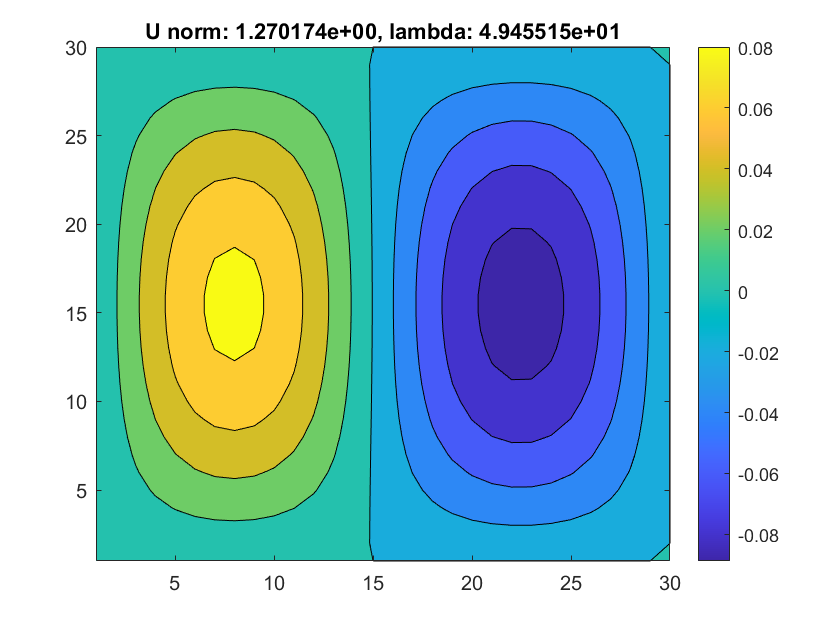
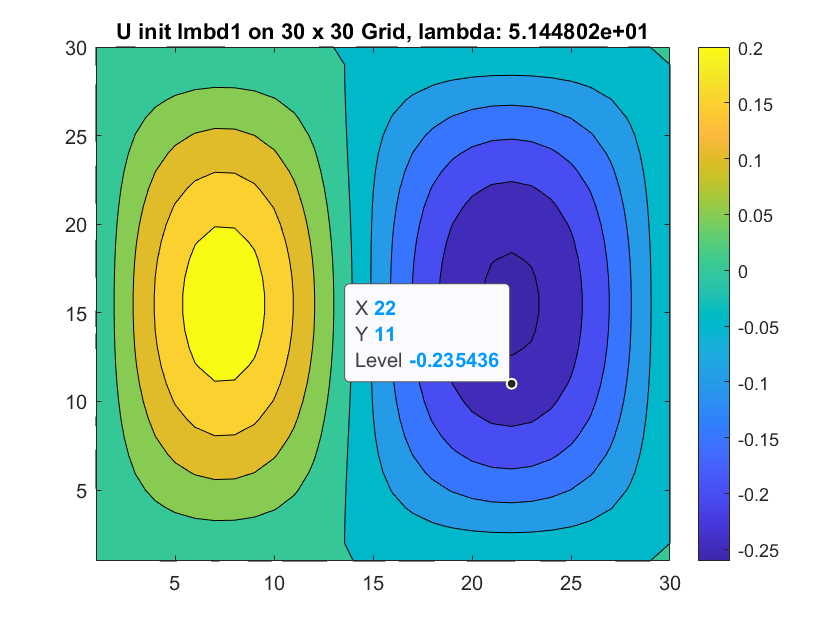

#### Ling xie
#### ENM 502-001
#### 2021-03-08
## Assignment 3 Newton method and Arc-length continuation

### Introduction

In this assignment, we would solve a non-linear boundary-value problem defined on the unit-square domain 
$$
\begin{aligned}
&\begin{array}{l}
D=(0 \leq x \leq 1) \cup(0 \leq y \leq 1) \\
\nabla^{2} u+\lambda u(1+u)=0
\end{array}\\
&u(x, y)=0 \text { on all boundaries, }
\end{aligned}
$$

with **newton method**. After we guess the initial solution on some typical `lambda`, we track track and iterate `lambda` from 
$$
0 \leq \lambda \leq 60
$$
with **analytic continuation(AyC)** and **arc-length continuation(ARCLC)**.

### Problem Setup and Formulation

##### Discretization and centered finite difference applied to this problem.

We discretize the `U` with finite difference method, in specifically a `30 X 30` uniform grid. 

##### Newton's Method

As a fixed-point iteration method, given a initial approximation at `U_0`, newton's method would approximate the solution in the derivative direction. 

The iteration goes like 
$$
\mathbf{u}^{k+1}=\mathbf{u}^{k}+\delta \mathbf{u}^{k}
$$
where $ \delta \mathbf{u}^{k} $ is calculated by 
$$
\left.{\mathbf{J}}\right|_{k}\left(\begin{array}{1}
{\partial \mathbf{u}}
\end{array}\right)_{k}=-\left({\partial {\mathbf{R}}}\right)_{k}
$$

where `J` is the Jacobin matrix.

For the initial value, when L2norm of $\lambda$ is near to zero, it could be visualized as a eigen value problem. The initial value near is like 

| lambda = 2 * pi^2            | lambda = 5 * pi^2            | lambda = 5 * pi^2              |
| ---------------------------- | ---------------------------- | ------------------------------ |
|  |  |  |

##### Methods to generate first two non-trivial solutions (analytical continuation)

We would use newton's method to solve for `U_0` from first initial guess(see image above). To calculate `U_1` , we use **AyC** to calculate the initial guess `U_1_guess`, then use newton's method to solve the solution at `lambda_1`.

##### Arc-Length Continuation

During iterating the `lambda`, the `J ` would become nearly singular during turning point. To prevent this, we introduce a new independent variable `s`.
$$
(\delta S)^{2}=(\delta \lambda)^{2}+\|\delta \mathbf{u}\|_{2}^{2}
$$
and start to iterate on `s` for the rest steps.

For each iteration, let's say we have `U_cur`, `lmbd_cur`, `U_prv` `lmbd_prv`, which is the solution of `k - 1`, `k - 2`iteration(it’s `kth iteration`)

during every iteration, we first use **arc-length initialization** to get initial guess , let’s say it be `U_cur_init`, `lmbd_cur_init`. 
$$
\begin{array}{l}
\mathbf{u}_{2}^{0}=\mathbf{u}_{1}+(\delta s)\left(\frac{\partial \mathbf{u}}{\partial s}\right)_{1} \\
\lambda_{2}^{0}=\lambda_{1}+(\delta s)\left(\frac{\partial \lambda}{\partial s}\right)_{1}
\end{array}
$$
And during **arc-length initialization** **, we would use `U_cur`, `lmbd_cur`to create the Jacobin matrix.

The we would use `U_cur_init`, `lmbd_cur_init` together with `U_prv` `lmbd_prv` to do the full newton iteration. The detailed iteration could be viewed as below.
$$
\begin{array}{l}
\left.\left.\left(\hat{\mathbf{J}}^{k}\right)\right|_{s 2}\left(\begin{array}{c}
\delta \mathbf{u}^{k} \\
\delta \lambda^{k}
\end{array}\right)\right|_{s 2}=-\left.\left(\hat{\mathbf{R}}^{k}\right)\right|_{s 2} \\
\lambda^{k+1}=\lambda^{k}+\delta \lambda^{k} \\
\mathbf{u}^{k+1}=\mathbf{u}^{k}+\delta \mathbf{u}^{k}
\end{array}
$$

### Results and Discussion

From my circumstances, I notice that with different mixture of parameters( **ARCLC** step size, initial point, etc), the results vary rapidly.

#### Failed cases

##### Rush to bottom

| $\lambda$ iteration                    | L2norm of U $lambda$                          | U                                   | U                                   |
| -------------------------------------- | --------------------------------------------- | ----------------------------------- | ----------------------------------- |
|  |  |  |  |

Rush to top

| $\lambda$ iteration                 | L2norm of U $lambda$                       | U                                | U                                |
| ----------------------------------- | ------------------------------------------ | -------------------------------- | -------------------------------- |
|  |  |  |  |

Rush to top

| $\lambda$ iteration                  | L2norm of U $lambda$                        | U                                 | U                                 |
| ------------------------------------ | ------------------------------------------- | --------------------------------- | --------------------------------- |
|  |  |  |  |

Up and down

| $\lambda$ iteration               | L2norm of U $lambda$                     | U                              | U                              |
| --------------------------------- | ---------------------------------------- | ------------------------------ | ------------------------------ |
|  |  |  |  |

#### Relatively make sense cases

| $\lambda$ iteration                 | L2norm of U $lambda$                       | U                                | U                                |
| ----------------------------------- | ------------------------------------------ | -------------------------------- | -------------------------------- |
|  |  |  |  |

| $\lambda$ iteration              | L2norm of U $lambda$                    | U                             | U                             |
| -------------------------------- | --------------------------------------- | ----------------------------- | ----------------------------- |
|  |  |  |  |

#### Performance with sparse matrix

Here we test the running time during solving the 
$$
\left.{\mathbf{J}}\right|_{k}\left(\begin{array}{1}
{\partial \mathbf{u}}
\end{array}\right)_{k}=-\left({\partial {\mathbf{R}}}\right)_{k}
$$

|                                      | Sparse   | Full    |
| ------------------------------------ | -------- | ------- |
| time(seconds) spent in 64 iterations | 2.158603 | 2.75824 |

Here `J ` is a banded matrix with bandwidth `2n` (the whole matrix J is `(n+1)^2`. As expected, matrix solving under this setting could benefit greatly from sparse matrix. 

### Conclusion

This is the expected whole graph of `L2 norm of U` vs `iteration`.

In my current version or ARCLC, the full newton's method(with `J_hat`) could hardly converge. I think that's the reason why the `lambda` vs iteration is not stable and smooth.

Despite, we still manage to see that the `U` could jump on another branch. As in last two examples, the hill-like and bowl-like solutions change signs when we are moving along the curve.  

| $\lambda$ iteration              | L2norm of U $lambda$                    | U                             | U                             |
| -------------------------------- | --------------------------------------- | ----------------------------- | ----------------------------- |
|  |  |  |  |

For this example(see image above), we see that although the it could switch on another branch, the branch could sometimes jump on trivial solution(where the `L2norm` becomes `0`), We guess this is due to the preset `d_s` is a kind of large step in this settings. 

In some rare circumstances(the first results), the `U` could sometimes move from `5pi^2`to `2pi^2` branch. 

### Code

Code repository is [here](https://github.com/Jack12xl/ENM502-2021-hw3).